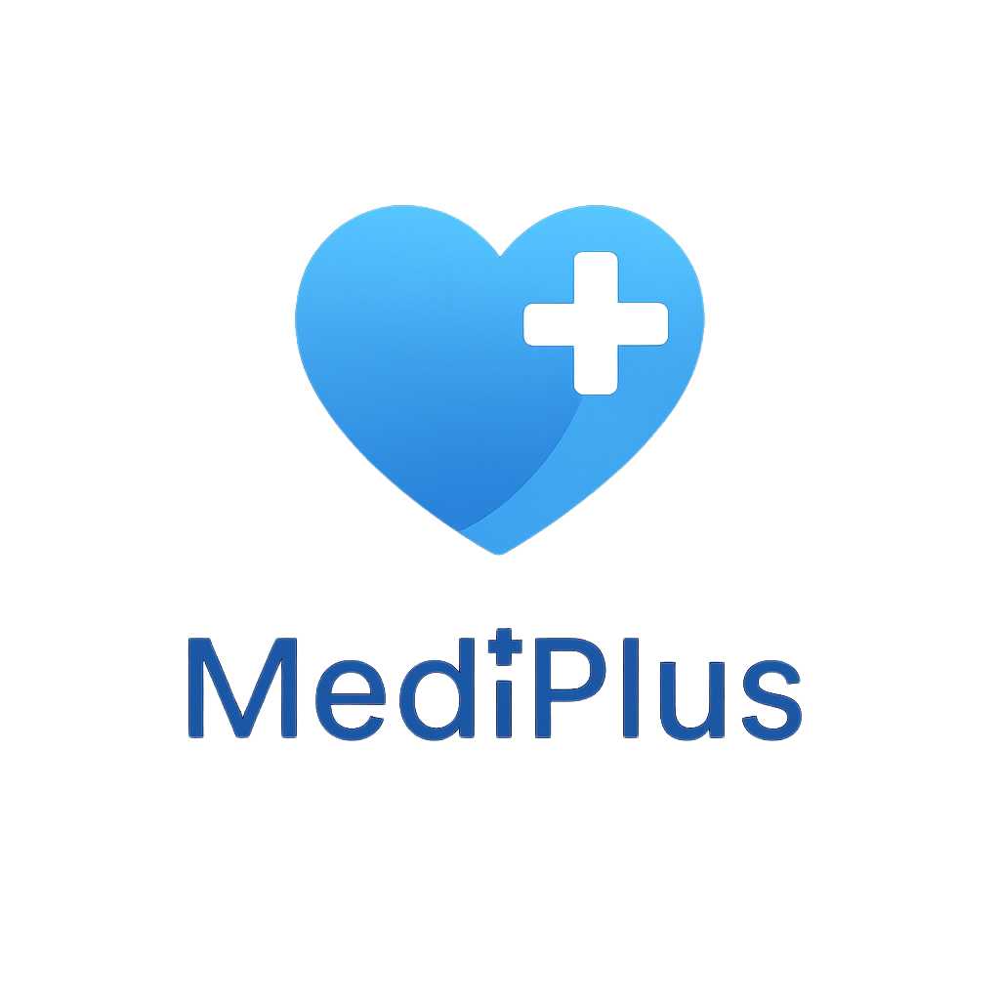

# MediPlus - AI-Powered Medical Health Assistant

<p align="center">
  
</p>

<p align="center">
  <strong>Your Digital Health Companion powered by MONAI & Advanced AI</strong>
</p>

<p align="center">
  
  
  
  
  
  
  
  
</p>

---

## Table of Contents

- [Overview](#overview)
- [Key Features](#key-features)
- [Technology Stack](#technology-stack)
- [Architecture](#architecture)
- [Project Structure](#project-structure)
- [Installation](#installation)
- [API Documentation](#api-documentation)
- [MONAI Models](#monai-models)
- [Sample Images](#sample-images)
- [Environment Variables](#environment-variables)
- [Development](#development)
- [Team & Credits](#team--credits)
- [Future Roadmap](#future-roadmap)
- [License & Disclaimer](#license--disclaimer)

---

## Overview

**MediPlus** is a comprehensive AI-powered mobile health application that combines cutting-edge medical imaging analysis with intelligent health insights. Built using MONAI (Medical Open Network for AI) and enhanced with Groq's LLM capabilities, MediPlus provides users with advanced health screening tools, medical image analysis, and an intelligent health chatbot.

The application leverages state-of-the-art deep learning models for medical image classification and segmentation, while providing human-readable explanations through large language model integration.

> **Important**: MediPlus provides health information for educational purposes only. Always consult qualified healthcare professionals for medical advice, diagnosis, or treatment.

---

## Key Features

### 1. Medical Image Analysis (MONAI-Powered)

| Feature | Conditions Detected | AI Model |
|---------|---------------------|----------|
| **Chest X-Ray Analysis** | Pneumonia, COVID-19, Cardiomegaly, Lung Nodules, Pleural Effusion, Atelectasis, Pneumothorax | DenseNet121 |
| **Skin Lesion Analysis** | Melanoma, Basal Cell Carcinoma, Benign Keratosis, Actinic Keratosis, Melanocytic Nevi, Vascular Lesion, Dermatofibroma | EfficientNetBN |
| **Eye Health Screening** | Diabetic Retinopathy (5 grades), Glaucoma, Macular Degeneration, Cataracts | DenseNet121 |

All image analysis is enhanced with **Groq LLM** (llama-3.3-70b-versatile) for detailed findings and recommendations.

### 2. Medical Image Segmentation

Advanced MONAI-powered segmentation capabilities:

- **Lung Segmentation (2D)** - Left/Right lung identification
- **Cardiac Segmentation (2D)** - Left ventricle, Right ventricle, Myocardium
- **Multi-Organ Segmentation (3D)** - Liver, Spleen, Kidneys
- **Tumor Segmentation** - Liver tumors, Brain tumors

**Supported Architectures**: UNet, BasicUNet, AttentionUnet, SegResNet, UNETR, SwinUNETR, VNet

### 3. Heart Disease Risk Prediction

Machine learning-based cardiovascular risk assessment using 13 clinical parameters from the UCI Heart Disease Dataset:

| Parameter | Description |
|-----------|-------------|
| Age | Patient age in years |
| Sex | Gender (1=male, 0=female) |
| CP | Chest pain type (0-3) |
| Trestbps | Resting blood pressure (mm Hg) |
| Chol | Serum cholesterol (mg/dl) |
| FBS | Fasting blood sugar > 120 mg/dl |
| Restecg | Resting ECG results (0-2) |
| Thalach | Maximum heart rate achieved |
| Exang | Exercise induced angina |
| Oldpeak | ST depression induced by exercise |
| Slope | Slope of peak exercise ST segment |
| CA | Number of major vessels (0-3) |
| Thal | Thalassemia type |

### 4. MediBot - AI Health Chatbot

24/7 intelligent health assistant powered by Groq's **llama-3.3-70b-versatile** model:

- Symptom information and guidance
- Medication dosage and interactions
- Wellness tips and lifestyle advice
- Test results explanation
- Persistent chat history with session management

---

## Technology Stack

### Frontend

| Technology | Version | Purpose |
|------------|---------|---------|
| **React Native** | 0.81.5 | Cross-platform mobile framework |
| **Expo** | 54.0.25 | Development platform & native modules |
| **TypeScript** | 5.9.2 | Type-safe JavaScript |
| **React Navigation** | 6.1.18 | App navigation (native-stack + bottom-tabs) |
| **AsyncStorage** | 2.2.0 | Local data persistence |
| **Groq SDK** | 0.36.0 | LLM integration |
| **Expo Image Picker** | 17.0.8 | Camera & gallery access |

### Backend

| Technology | Version | Purpose |
|------------|---------|---------|
| **Flask** | 2.3.0+ | Python web framework |
| **Flask-CORS** | 4.0.0+ | Cross-origin resource sharing |
| **PyTorch** | 2.0+ | Deep learning framework |
| **MONAI** | 1.3.0+ | Medical AI framework |
| **Groq** | 0.4.0+ | LLM enhancement API |
| **Gunicorn** | 21.0.0+ | Production WSGI server |

### Medical Imaging Libraries

- **nibabel** - NIfTI/DICOM file support
- **pydicom** - DICOM file handling
- **SimpleITK** - Cross-platform medical image I/O
- **scikit-image** - Image processing utilities
- **OpenCV** - Computer vision operations

### Optional Intel Optimizations

- **Intel Extension for PyTorch (IPEX)** - CPU optimization
- **OpenVINO** - Intel Iris GPU acceleration

---

## Architecture

```
┌─────────────────────────────────────────────────────────────────────┐
│                         MOBILE APPLICATION                           │
│  ┌─────────────────────────────────────────────────────────────┐   │
│  │  React Native + Expo + TypeScript                            │   │
│  │  ┌──────────┐ ┌──────────┐ ┌──────────┐ ┌──────────────┐   │   │
│  │  │   Home   │ │   Chat   │ │  Heart   │ │    Image     │   │   │
│  │  │  Screen  │ │  Screen  │ │  Screen  │ │   Analysis   │   │   │
│  │  └──────────┘ └──────────┘ └──────────┘ └──────────────┘   │   │
│  │  ┌───────────────────┐  ┌──────────────────────────────┐   │   │
│  │  │   Segmentation    │  │         Settings             │   │   │
│  │  │      Screen       │  │          Screen              │   │   │
│  │  └───────────────────┘  └──────────────────────────────┘   │   │
│  └─────────────────────────────────────────────────────────────┘   │
└────────────────────────────┬────────────────────────────────────────┘
                             │ REST API (JSON)
                             ▼
┌─────────────────────────────────────────────────────────────────────┐
│                         FLASK BACKEND                                │
│  ┌─────────────────────────────────────────────────────────────┐   │
│  │                      API Endpoints                           │   │
│  │  /api/health  /api/predict/heart  /api/analyze/*            │   │
│  │  /api/segment  /api/v2/analyze/*  /api/monai/info           │   │
│  └─────────────────────────────────────────────────────────────┘   │
│                             │                                        │
│  ┌──────────────────────────┴──────────────────────────────────┐   │
│  │                     SERVICE LAYER                            │   │
│  │  ┌──────────────┐  ┌──────────────┐  ┌──────────────────┐  │   │
│  │  │ Chest X-Ray  │  │ Skin Lesion  │  │   Eye Health     │  │   │
│  │  │   Service    │  │   Service    │  │    Service       │  │   │
│  │  └──────────────┘  └──────────────┘  └──────────────────┘  │   │
│  │  ┌──────────────┐  ┌──────────────┐  ┌──────────────────┐  │   │
│  │  │Heart Disease │  │ Segmentation │  │  AI Enhancement  │  │   │
│  │  │   Service    │  │   Service    │  │    Service       │  │   │
│  │  └──────────────┘  └──────────────┘  └──────────────────┘  │   │
│  └─────────────────────────────────────────────────────────────┘   │
│                             │                                        │
│  ┌──────────────────────────┴──────────────────────────────────┐   │
│  │                    MONAI MODULES                             │   │
│  │  ┌────────────┐  ┌────────────┐  ┌────────────────────┐    │   │
│  │  │ Transforms │  │  Networks  │  │     Inference      │    │   │
│  │  └────────────┘  └────────────┘  └────────────────────┘    │   │
│  └─────────────────────────────────────────────────────────────┘   │
└─────────────────────────────────────────────────────────────────────┘
                             │
           ┌─────────────────┼─────────────────┐
           ▼                 ▼                 ▼
    ┌────────────┐   ┌────────────┐   ┌────────────┐
    │  PyTorch   │   │   MONAI    │   │  Groq LLM  │
    │  Models    │   │  Framework │   │    API     │
    └────────────┘   └────────────┘   └────────────┘
```

---

## Project Structure

```
MediPlus/
├── App.tsx                          # React Native entry point
├── app.config.js                    # Expo configuration
├── package.json                     # Frontend dependencies
├── index.ts                         # Entry point
│
├── src/                             # Frontend source code
│   ├── screens/                     # Application screens
│   │   ├── HomeScreen.tsx           # Dashboard with feature cards
│   │   ├── ChatScreen.tsx           # MediBot AI chatbot
│   │   ├── HeartScreen.tsx          # Heart disease risk form
│   │   ├── ImageAnalysisScreen.tsx  # Medical image analysis UI
│   │   ├── SegmentationScreen.tsx   # MONAI segmentation UI
│   │   └── SettingsScreen.tsx       # App settings
│   │
│   ├── components/                  # Reusable UI components
│   │   ├── Header.tsx               # App header with logo
│   │   ├── ChatHistoryModal.tsx     # Chat session history
│   │   └── MONAIInfoCard.tsx        # MONAI capabilities info
│   │
│   ├── services/                    # API & business logic
│   │   ├── imageAnalysisService.ts  # Image analysis API calls
│   │   ├── groqService.ts           # Groq LLM integration
│   │   ├── monaiService.ts          # Segmentation API calls
│   │   ├── heartService.ts          # Heart prediction API
│   │   └── chatStorageService.ts    # AsyncStorage chat persistence
│   │
│   ├── navigation/
│   │   └── TabNavigator.tsx         # Bottom tab navigation
│   │
│   ├── constants/
│   │   ├── config.ts                # API endpoints configuration
│   │   └── theme.ts                 # Colors, sizing, responsive design
│   │
│   └── utils/
│       └── responsive.ts            # Responsive design utilities
│
├── backend/                         # Flask Python backend
│   ├── app.py                       # Main Flask application
│   ├── requirements.txt             # Python dependencies (67 packages)
│   │
│   ├── services/                    # Business logic & ML services
│   │   ├── heart_disease_service.py # Heart risk prediction
│   │   ├── chest_xray_service.py    # Chest X-ray analysis (MONAI)
│   │   ├── skin_lesion_service.py   # Skin lesion classification
│   │   ├── eye_health_service.py    # Diabetic retinopathy screening
│   │   ├── ai_vision_service.py     # Groq LLM enhancement
│   │   ├── segmentation_service.py  # Image segmentation
│   │   └── enhanced_analysis_service.py
│   │
│   ├── monai_modules/               # MONAI framework wrappers
│   │   ├── transforms.py            # Image preprocessing transforms
│   │   ├── networks.py              # Model architecture definitions
│   │   ├── inference.py             # Inference engines
│   │   ├── losses.py                # Loss functions
│   │   ├── metrics.py               # Evaluation metrics
│   │   └── data_loading.py          # Data loading utilities
│   │
│   └── models/                      # ML model storage
│
├── assets/
│   └── logo.png                     # App icon (126 KB)
│
└── images/                          # Sample medical images (8 files)
```

---

## Installation

### Prerequisites

- **Node.js** >= 18.0.0
- **Python** >= 3.9
- **Expo CLI** (`npm install -g expo-cli`)
- **Groq API Key** ([console.groq.com](https://console.groq.com))

### Frontend Setup

```bash
# Clone the repository
git clone https://github.com/nevil06/MediPlus.git
cd MediPlus

# Install dependencies
npm install

# Create environment file
cp .env.example .env
# Edit .env and add your GROQ_API_KEY

# Start development server
npm start

# Run on specific platform
npm run android   # Android
npm run ios       # iOS
npm run web       # Web browser
```

### Backend Setup

```bash
# Navigate to backend directory
cd backend

# Create virtual environment
python -m venv venv
source venv/bin/activate        # Linux/macOS
# venv\Scripts\activate         # Windows

# Install dependencies
pip install -r requirements.txt

# Configure environment
cp .env.example .env
# Edit .env with your configuration

# Start the Flask server
python app.py

# For production
gunicorn -w 4 -b 0.0.0.0:5000 app:app
```

### Intel Optimization (Optional)

```bash
# Uncomment in backend/requirements.txt:
intel-extension-for-pytorch>=2.0.0
openvino>=2023.0.0

# Set environment variables
export INTEL_OPTIMIZATION=true
export OPENVINO_DEVICE=GPU  # or CPU
```

---

## API Documentation

### Base URL

```
http://localhost:5000/api
```

### Endpoints

| Endpoint | Method | Description |
|----------|--------|-------------|
| `/api/health` | GET | Health check |
| `/api/predict/heart` | POST | Heart disease prediction |
| `/api/assess/quick` | POST | Quick health assessment |
| `/api/analyze/chest-xray` | POST | Chest X-ray analysis |
| `/api/v2/analyze/chest-xray` | POST | Chest X-ray analysis (v2) |
| `/api/analyze/skin` | POST | Skin lesion analysis |
| `/api/v2/analyze/skin` | POST | Skin lesion analysis (v2) |
| `/api/analyze/eye` | POST | Eye health analysis |
| `/api/v2/analyze/eye` | POST | Eye health analysis (v2) |
| `/api/segment` | POST | Medical image segmentation |
| `/api/segment/tasks` | GET | Available segmentation tasks |
| `/api/monai/info` | GET | MONAI capabilities |

### Heart Disease Prediction

**Request:**
```http
POST /api/predict/heart
Content-Type: application/json

{
  "age": 45, "sex": 1, "cp": 2, "trestbps": 130,
  "chol": 250, "fbs": 0, "restecg": 1, "thalach": 150,
  "exang": 0, "oldpeak": 1.5, "slope": 1, "ca": 0, "thal": 2
}
```

### Medical Image Analysis

**Request:**
```http
POST /api/v2/analyze/chest-xray
Content-Type: application/json

{
  "image": "base64_encoded_image_data"
}
```

**Response:**
```json
{
  "success": true,
  "analysis": {
    "primary_finding": "Pneumonia",
    "confidence": 0.95,
    "risk_level": "High",
    "ai_enhancement": {
      "detailed_explanation": "...",
      "recommendation": "...",
      "lifestyle_advice": [...]
    }
  }
}
```

---

## MONAI Models

### Classification Networks

| Network | Use Case |
|---------|----------|
| DenseNet121/169/201/264 | Image classification |
| EfficientNetBN | Efficient classification |
| ResNet50/101/152 | General classification |
| SENet154, SEResNet | Attention-based classification |

### Segmentation Networks

| Network | Dimensions | Best For |
|---------|------------|----------|
| **UNet** | 2D/3D | General segmentation |
| **AttentionUnet** | 2D/3D | Fine-grained details |
| **SegResNet** | 2D/3D | Medical imaging |
| **UNETR** | 2D/3D | Transformer-based segmentation |
| **SwinUNETR** | 2D/3D | Swin Transformer |
| **VNet** | 3D | Volumetric segmentation |

### MONAI Transforms

- **Loading**: LoadImage, EnsureChannelFirst
- **Spatial**: Resize, Rotate, Flip, Zoom, Affine
- **Intensity**: ScaleIntensity, NormalizeIntensity
- **Augmentation**: RandFlip, RandRotate90, RandGaussianNoise

---

## Sample Images

Located in `/images/` directory:

| File | Type | Size |
|------|------|------|
| `chestxray.jpg` | Chest X-Ray | 4.1 KB |
| `skinlisson.jpg` | Dermatology | 2.9 KB |
| `eyes-opendiabities.jpg` | Ophthalmology | 78 KB |
| `kidney-cancer-visible-on-CT-scan.jpg` | CT | 105 KB |
| `X-ray-showing-a-brown-tumor.png` | X-Ray | 393 KB |
| `stock-photo-ct-computed-tomography-scan.jpg` | CT | 429 KB |
| `stock-photo-the-radiography-show-metastasis.jpg` | X-Ray | 194 KB |

---

## Environment Variables

### Frontend (.env)

```bash
GROQ_API_KEY=your_groq_api_key_here
BACKEND_URL=http://localhost:5000
```

### Backend (.env)

```bash
HOST=0.0.0.0
PORT=5000
DEBUG=True
GROQ_API_KEY=your_groq_api_key_here
INTEL_OPTIMIZATION=false
OPENVINO_DEVICE=CPU
```

**Get your Groq API key at:** [console.groq.com/keys](https://console.groq.com/keys)

---

## Development

### Running Tests

```bash
# Backend tests
cd backend
pytest tests/ -v --cov=services

# Frontend type checking
npm run typecheck
```

### Building for Production

```bash
# Frontend - Expo EAS Build
eas build --platform android
eas build --platform ios

# Backend - Docker
docker build -t mediplus-backend .
docker run -p 5000:5000 mediplus-backend
```

---

## Team & Credits

### Development Team

| Name | Role | Contact |
|------|------|---------|
| **Nevil D'Souza** | Team Leader | - |
| **Harsha N** | Developer | harsha210108@gmail.com |
| **Naren V** | Developer | narenbhaskar2007@gmail.com |
| **Manas Kiran Habbu** | Developer | manaskiranhabbu@gmail.com |
| **Mithun Gowda B** | Developer | mithungowda.b7411@gmail.com |

### Technologies & Acknowledgments

| Technology | Provider |
|------------|----------|
| **[MONAI](https://monai.io/)** | NVIDIA & Partners |
| **[PyTorch](https://pytorch.org/)** | Meta AI |
| **[Groq](https://groq.com/)** | Groq Inc. |
| **[Expo](https://expo.dev/)** | Expo |
| **[React Native](https://reactnative.dev/)** | Meta |
| **[Flask](https://flask.palletsprojects.com/)** | Pallets |

### Datasets

- **UCI Heart Disease Dataset** - Cleveland database
- **MONAI Model Zoo** - Pre-trained models

---

## Future Roadmap

### Completed

- [x] Medical image analysis (Chest X-Ray, Skin, Eye)
- [x] MONAI + Groq AI integration
- [x] AI-powered MediBot chatbot
- [x] Heart disease risk prediction
- [x] Medical image segmentation
- [x] Chat history persistence

### Planned

- [ ] Advanced health analytics dashboard
- [ ] Wearable device integration
- [ ] Telemedicine features
- [ ] Multi-language support
- [ ] Cloud sync for health records
- [ ] Offline model inference

---

## License & Disclaimer

### License

This project was developed as part of a hackathon.

### Medical Disclaimer

**IMPORTANT**: MediPlus is for **educational purposes only**. It is NOT intended to:

- Provide medical diagnosis or treatment
- Replace professional medical advice
- Be used as a substitute for qualified healthcare providers

**Always consult your physician** with questions about medical conditions. AI models have **limitations and may produce inaccurate results**.

---

<p align="center">
  
</p>

<p align="center">
  <strong>Made with dedication for better healthcare</strong>
</p>

<p align="center">
  <sub>MediPlus - Hackathon Project</sub>
</p>
